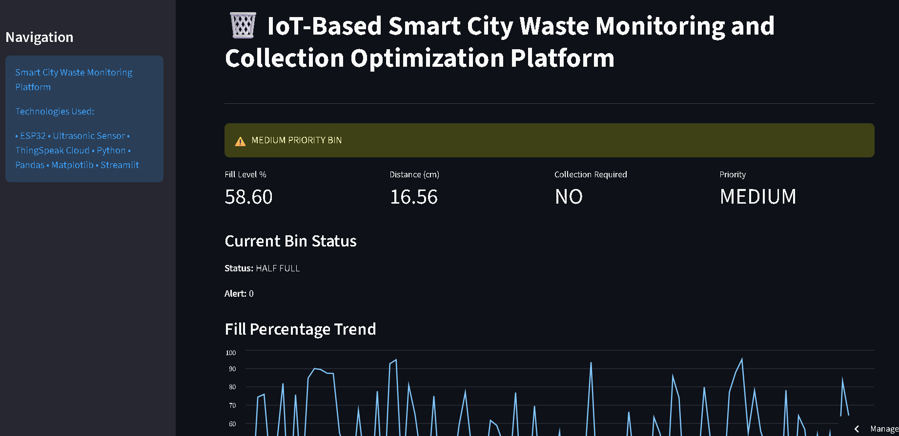
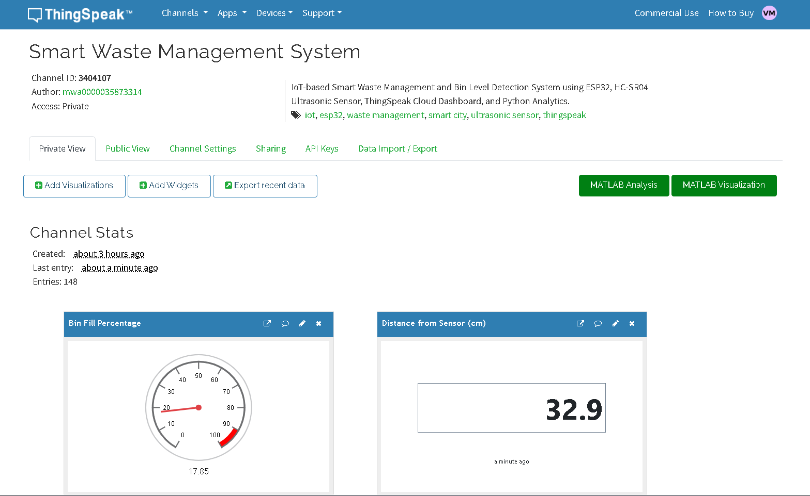
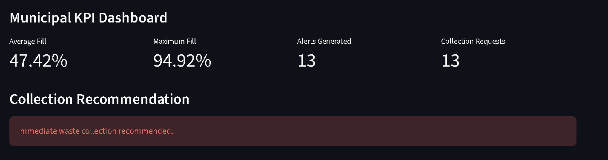
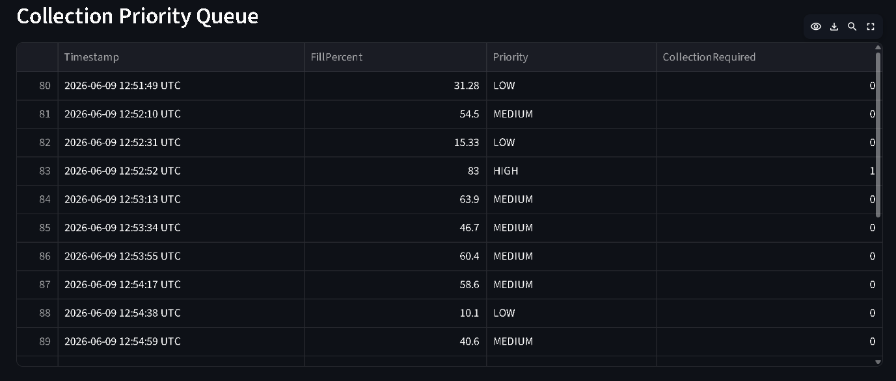

# 🗑️ Smart City Waste Monitoring and Collection Optimization Platform

An IoT-based Smart Waste Management System that enables real-time monitoring of municipal waste bins using ESP32, Ultrasonic Sensors, ThingSpeak Cloud, Python Analytics, and Streamlit Dashboard.

The system continuously monitors bin fill levels, generates intelligent collection recommendations, and provides municipal authorities with data-driven insights to optimize waste collection operations and improve urban sustainability.

---

## 🌐 Live Demo

### Streamlit Dashboard
https://smart-city-waste-monitoring-and-collection-optimization-platfo.streamlit.app/

### GitHub Repository
https://github.com/Vayu-143/Smart-City-Waste-Monitoring-and-Collection-Optimization-Platform

---

## 👨‍💻 Developer

**Vayunandan Mishra**

B.Tech Student | IoT & Smart City Solutions Enthusiast

---

# 📌 Project Overview

Urban waste management remains a significant challenge due to increasing population density and inefficient collection schedules.

Traditional waste collection methods often lead to:

- Overflowing garbage bins
- Unnecessary collection trips
- Increased fuel consumption
- Poor resource allocation
- Environmental pollution

This project introduces a smart waste monitoring solution that:

- Monitors waste levels in real time
- Predicts collection requirements
- Generates priority-based alerts
- Provides municipal KPI analytics
- Enables data-driven decision making

---

# 🚀 Key Features

### 📡 Real-Time Bin Monitoring

- ESP32-based IoT system
- Ultrasonic sensor for fill-level measurement
- Live distance and fill-percentage calculations

### ☁️ Cloud Integration

- ThingSpeak cloud data storage
- Real-time data transmission
- Historical data availability

### 📊 Interactive Dashboard

- Streamlit-based analytics dashboard
- Auto-refreshing live metrics
- Dynamic trend visualization

### 🚨 Smart Alert System

- High-priority overflow detection
- Collection request generation
- Automated alert monitoring

### 📈 Municipal Analytics

- Fill-level trends
- Collection request statistics
- Priority distribution analysis
- Operational KPI dashboard

### 📄 Reporting

- Historical waste records
- PDF report generation
- Downloadable analytics reports

---

# 🏗️ System Architecture

```text
Ultrasonic Sensor
        │
        ▼
      ESP32
        │
        ▼
   ThingSpeak Cloud
        │
        ▼
 Python Data Processing
        │
        ▼
 Streamlit Dashboard
        │
        ▼
 Municipal Decision Support
```

---

# 🛠️ Technology Stack

| Layer | Technology |
|---------|------------|
| Hardware | ESP32 |
| Sensor | HC-SR04 Ultrasonic Sensor |
| Cloud | ThingSpeak |
| Programming | Python |
| Data Processing | Pandas |
| Visualization | Matplotlib |
| Dashboard | Streamlit |
| Version Control | Git & GitHub |

---

# 📂 Project Structure

```text
Smart-City-Waste-Monitoring-and-Collection-Optimization-Platform
│
├── arduino_code/
│
├── dashboard/
│   └── app.py
│
├── data/
│   └── waste_data.csv
│
├── images/
│   ├── smart_city_dashboard.png
│   ├── thingspeak_dashboard.png
│   ├── municipal_kpi_dashboard.png
│   └── collection_priority_queue.png
│
├── outputs/
│   └── smart_city_waste_report.pdf
│
├── python_simulation/
│   ├── simulator.py
│   ├── thingspeak_sender.py
│   ├── analytics.py
│   └── report_generator.py
│
├── requirements.txt
│
└── README.md
```

---

# 📸 Project Screenshots

## Smart City Dashboard



---

## ThingSpeak Cloud Monitoring



---

## Municipal KPI Dashboard



---

## Collection Priority Queue



---

# ⚙️ Installation

## Clone Repository

```bash
git clone https://github.com/Vayu-143/Smart-City-Waste-Monitoring-and-Collection-Optimization-Platform.git

cd Smart-City-Waste-Monitoring-and-Collection-Optimization-Platform
```

## Create Virtual Environment

```bash
python -m venv venv
```

### Windows

```bash
venv\Scripts\activate
```

### Linux / Mac

```bash
source venv/bin/activate
```

## Install Dependencies

```bash
pip install -r requirements.txt
```

## Run Waste Simulator

```bash
python python_simulation/simulator.py
```

## Launch Dashboard

```bash
streamlit run dashboard/app.py
```

---

# 📈 Dashboard KPIs

The dashboard provides:

- Current Fill Percentage
- Bin Status
- Collection Requirement
- Priority Level
- Average Fill Percentage
- Maximum Fill Percentage
- Total Alerts Generated
- Collection Requests
- Historical Waste Records

---

# 🎯 Business Impact

✅ Reduces unnecessary collection trips

✅ Prevents waste overflow

✅ Improves operational efficiency

✅ Enables predictive waste collection

✅ Reduces fuel consumption

✅ Supports smart-city initiatives

✅ Enhances municipal decision-making

---

# 🔮 Future Enhancements

- GPS-enabled route optimization
- Machine Learning-based waste prediction
- Mobile application integration
- Multi-bin monitoring system
- Email and SMS notifications
- AI-powered collection scheduling
- Smart City GIS integration

---

# 📊 Project Highlights

- Real-Time IoT Monitoring
- Cloud-Based Data Storage
- Intelligent Collection Recommendation
- Municipal KPI Analytics
- Priority-Based Waste Management
- Interactive Streamlit Dashboard
- Automated Report Generation

---

# 📜 License

This project is developed for educational, research, and smart-city innovation purposes.

---

# ⭐ Support

If you found this project useful:

⭐ Star the repository

🍴 Fork the project

📢 Share it with others

---

## Contact

**Vayunandan Mishra**

GitHub: https://github.com/Vayu-143

Project Repository:
https://github.com/Vayu-143/Smart-City-Waste-Monitoring-and-Collection-Optimization-Platform

Live Dashboard:
https://smart-city-waste-monitoring-and-collection-optimization-platfo.streamlit.app/

---

**Developed by Vayunandan Mishra 🚀**

*IoT-Based Smart City Waste Monitoring and Collection Optimization Platform*